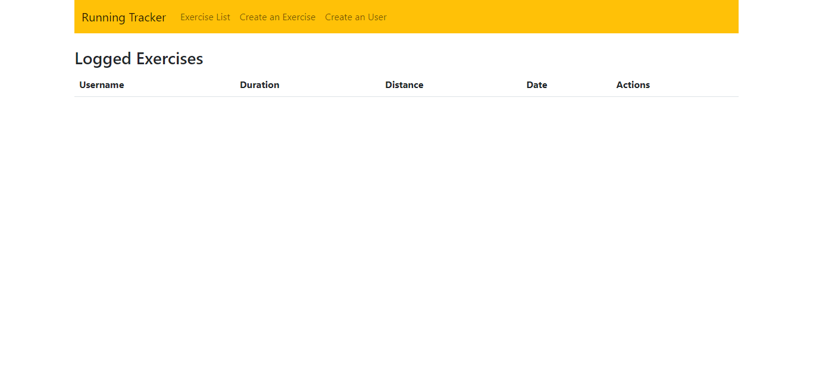

# Running Tracker

  ## Description

  This application allows you to track your runs. 

  ## Deployed Link

  https://running-track.herokuapp.com/

  

  ## Technologies Used

  * Mongoose
  * Express.js
  * React.js
  * Node.js
  * Bootstrap

  ## Table of Contents

  * [Installation](#installation)
  * [Usage](#usage)
  * [Credits](#credits)
  * [License](#license)

  ## Installation

  No installation is required.

  ## Usage

  You follow the deployed URL and you go to 'Create an Exercise' to create a new exercise and 'Create an User' to create a new user. You can go to 'Exercise List' to view your exercises.

  ## Contributed By:

  * Lisseth Diaz

  ## License

  None
  

  ---

  ## Tests

  No tests 

  ## Questions

  If you have questions:
  * [Github](https://github.com/lissethdiaz)
  * [Email](mailto:lissdiaz15@gmail.com) 